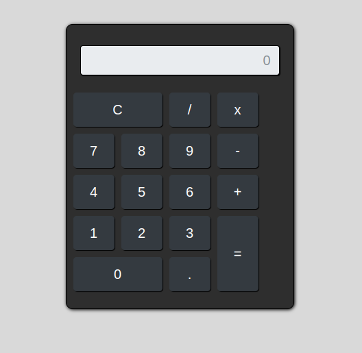

# Calculadora

Este projeto consiste no desenvolvimento de uma calculadora simples, que realiza as **funções básicas** de matemática:

- Subtração
- Soma
- Multiplicação
- Divisão

### Ferramentas de desenvolvimento

 HTML
  CSS
   JavaScript
   Bootstrap